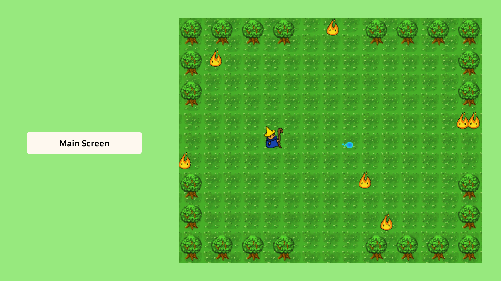
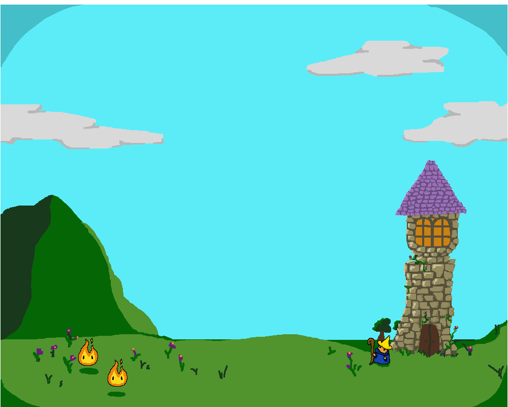
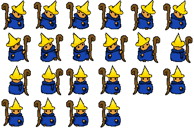

# **Wizard's Curse** 

> Wizard's Curse is a top-down shooter, where you play a little forest wizard that has to defend his forest from fire spirits.

---

## 🌐 **Play the Game**
Unfortunately I couldn't host the game via github without upgrading (paying) for github premium, sorry!
---

## 📸 **Screenshots**

### Main Gameplay:

  
  
*Figure 1: Example of gameplay in action.*

---

### Menu and UI:

  
  
*Figure 2: Menu and user interface.*

---

## 🎨 **Spritesheets**
Below are the sprites used to create characters and objects in the game:

### Player Character:

  
  
*Figure 3: Player character animations.*

---

### Enemies and NPCs:

  
  
*Figure 4: Enemy animations.*

---

## ✍️ **Reflection**

### What went well:
- **Design:** Designing the Character Sprites was a lot of fun!
- **Consistency:** I stuck to the idea I had from the beginning on, and I made a playable game! YAY!

### Challenges:
- **Time Constraints:** I had a difficult time implementing more complex gameplay due to the limited timeframe.
- **Bug Fixes:** I had a tough time fixing bugs on my own, and had to ask for help for a lot of them. Unfortunately, I wasn't able to fix the player sprites bug. :(

### Lessons Learned:
- **Time Management:** Managing my time efficiently, in order to not get stressed out too much toward the end of CCL was so much more important than I anticipated.
- **Problem Solving:** I feel like this CCL was a great lesson in problem solving. Encountering problems and solving them creatively proved to be very useful.
